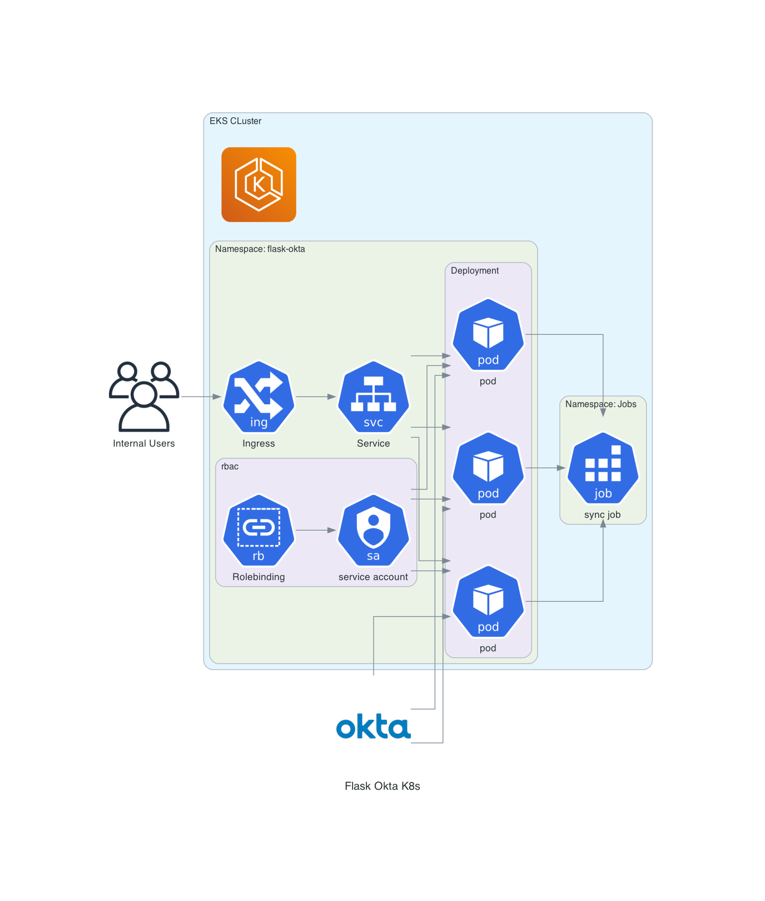
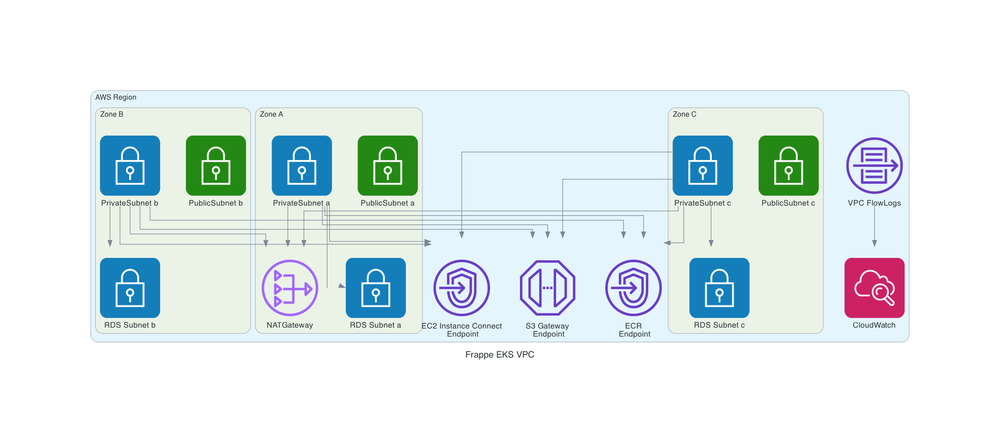
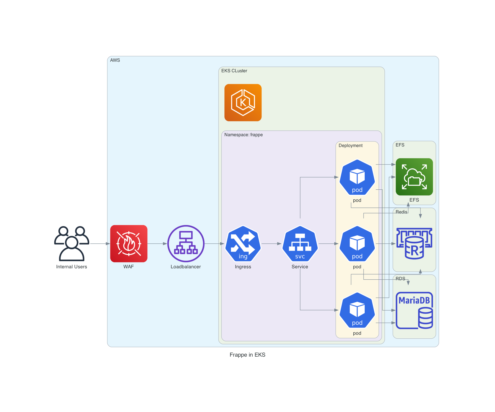

# Flask-Okta-K8s & Frappe-EKS Infrastructure as Code (IaC)

This repository contains code and infrastructure diagrams for deploying Flask with Okta integration on Kubernetes (K8s) and Frappe on Amazon Elastic Kubernetes Service (EKS). The infrastructure is defined and visualized using **Diagrams as Code**.

## Repository Structure

- **`flask-okta-k8s/`**: Code and diagrams for Flask with Okta integration on Kubernetes.
- **`frappe-eks/`**: Code and diagrams for Frappe on EKS.

Each folder contains:
1. **Infrastructure Code**: The IaC scripts and configuration files.
2. **Diagrams**: High-level architecture represented using **Diagrams as Code**.
3. **Documentation**: A detailed explanation of the folder contents and architecture.

---

## Infrastructure Diagrams

### Flask-Okta-K8s

### Frappe-EKS

---

## Documentation

For detailed explanations, visit the respective folder:

- [Flask-Okta-K8s Documentation](./flask-okta-k8s/README.md)
- [Frappe-EKS Documentation](./frappe-eks/README.md)

---